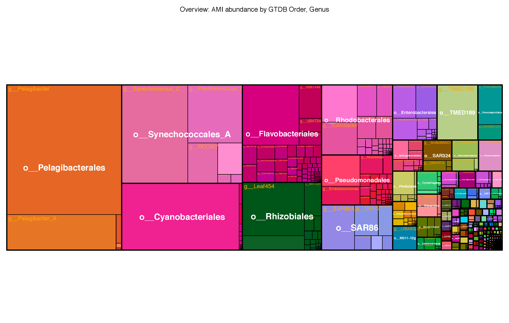

# Amplicon analysis workflow

1. Raw data download
2. [Amplicon Sequence Pipeline](./dada2)
3. [Assembling sequence variant tables](./dada2)
4. [Taxonomic assignment using DADA2](./dada2)
5. Comparison between methods 
6. Ecological Statistics
7. Ordination, visualisation and presentation
8. Community Thermal Index
9. [Boosted Regression Tree Modelling](../../BRT_2018)

# Metagenome analysis workflow

10. Assembly
11. Co-assembly
12. Binning and bin-refining
13. [Metagenome Assembled Genomes (MAGs)](./mags)
14. Annotation
15. Metatranscriptome analyses

# Additional routines

10. Spatial mapping SST, Chl
11. PAR
12. Cyano Reference Database
13. HPC tools
14. Interactive Maps
15. Flow cytometry

# Publications

* [STAR](./misc/STAR/star.md)
* [Sydney Harbour](./R)
* [Data Science 2018](./R)
* [Whale snot microbiomes 2018](./R)
* [EAC 2020](./R)

## References

## Overview

### Contact

Martin Ostrowski. Ocean Microbiology Group, C3 Institute, University of Technology, Sydney
email: [Martin Ostrowski](martin.ostrowski@uts.edu.au)

Uniques data was processed from [The Australian Microbiome](https://www.australianmicrobiome.com) raw data by [Matt Smith](), [Andrew Bissett]() & [Mark Brown]()

### Acknowlegement

We acknowledge the contribution of the AMMBI Project and Marine Microbes consortium in the generation of data used in this publication. The Marine Microbes project was supported by funding from Bioplatforms Australia through the Australian Government National Collaborative Research Infrastructure Strategy (NCRIS) in partnership with the Australian research community.

### References
* [The Australian Microbiome](https://www.australianmicrobiome.com) [Data Portal](https://data.bioplatforms.com/organization/about/australian-microbiome)
* The Genome Tree Database [GTDB](http://gtdb.ecogenomic.org)
* The Protist Reference Database 2 [PR2](https://github.com/pr2database/pr2database)

