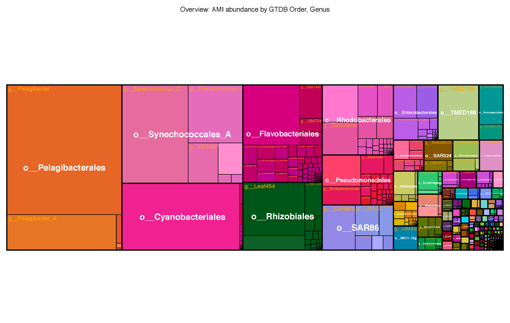

# The Rationale for unfiltered data

The rationale for providing an unfiltered dataset follows the observation that some ecologically significant zOTUs (ASVs) were disappearing from the processed table. The cause was identified as the denoising step (carried out with unoise3 within the AMI amplicon processing pipeline). Within the Order Cyanobacteriia, Genus _Synechococcus_, two ecologically significant clades display a single base pair change within the 16S SSU rRNA gene V1-V3 region (27F-~520R), i.e clade II (subclades abc) and clade IV. The denoising process resulted in the merger of clade IV into clade II, thereby affecting the accuracy of abundances for each ASV.

The non-filtered data was supplied as a single 3 column file (seq, sampleid_plate, abund) for each site_plate combination (~107GB for the NRS data alone).

pre-filtering involved removal of all sequences with < 3 abundance on a sequencing run as well as removal of all sequences containing N. n.b. some sequences displayed N at the terminal base, which could be trimmed and retained with modifications to the 'uniques' pipeline

## R scripts

This directory contains the backbone of R scripts for preparing a filtered zOTU table for the 7 different sample types from the input data. Some general description of the dataset is provided (Rank Abundance, zOTU collector curve and an overview of the taxonomic diversity provided by a treemap representation)

## Progress

- [x] Prepare bacterial 16S table
- [x] Basic statistics
- [x] Assign taxonomy against GTDB 16S rRNA databasae
- [ ] processed tables are available in-house

### Contact

Martin Ostrowski. Ocean Microbiology Group, C3 Institute, University of Technology, Sydney
email: [Martin Ostrowski](martin.ostrowski@uts.edu.au)

### References

* The Genome Tree Database [GTDB](http://gtdb.ecogenomic.org)
* The Protist Reference Database 2 [PR2](https://github.com/pr2database/pr2database)
